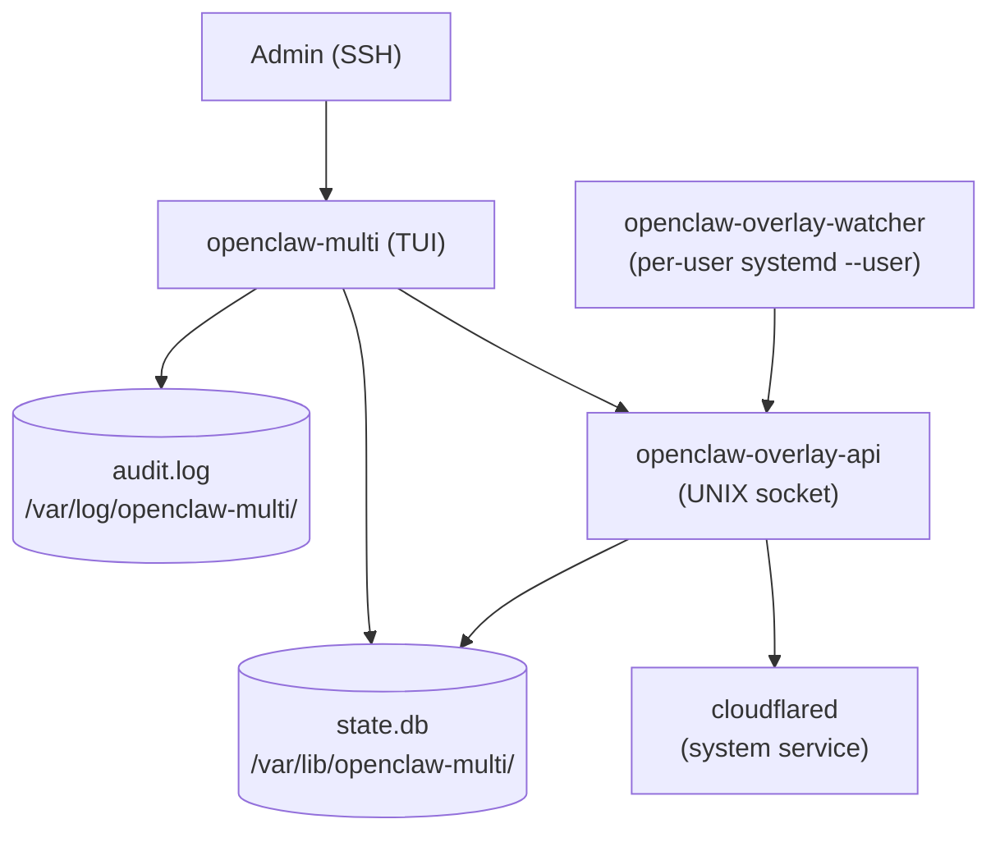

# Architecture

> Overview of the `openclaw-multi` overlay. For the full design rationale see
> [OPENCLAW_OVERLAY_PLAN_RU.md](../OPENCLAW_OVERLAY_PLAN_RU.md) (Russian).

## Overview

`openclaw-multi` is a Go-based administrative TUI that automates multi-user
[OpenClaw](https://github.com/openclaw/openclaw) deployments on a single Linux
VPS. It manages user isolation, network tunnels, and the complete user lifecycle
without modifying the OpenClaw core.

## Three Binaries

```
openclaw-multi          Admin TUI (Bubble Tea). Run by the admin in SSH.
openclaw-overlay-api    System daemon (HTTP on UNIX socket). Manages cloudflared
                        config and is the only component that can write to
                        /etc/cloudflared/config.yml. (Phase 6)
openclaw-overlay-watcher  Per-user daemon. Watches ~/.openclaw/openclaw.json
                          via inotify and calls overlay-api to publish routes.
                          (Phase 7)
```



## State Storage

SQLite database at `/var/lib/openclaw-multi/state.db`. Schema defined in
[schemas/state.sql](../schemas/state.sql). Go access via `internal/state`.

Key tables: `admin`, `users`, `routes`, `port_pool`, `backups`, `migrations`.

## Audit Log

JSONL file at `/var/log/openclaw-multi/audit.log`. Every mutating action emits
one JSON object per line. Required fields: `ts`, `actor`, `action`, `target`,
`result`. See `internal/audit` for event types.

Format defined in master plan §12 OQ-1.

## Tests

- Unit tests: `go test ./...` (pure Go, no system deps)
- Integration: `test/integration/` (systemd container)
- E2E smoke: `make test-phase-0` (Docker, ubuntu:22.04)
